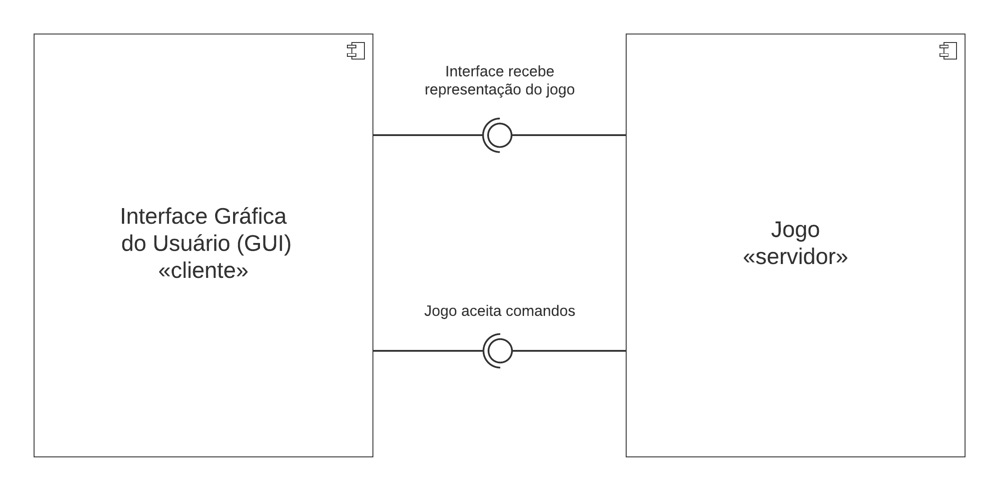
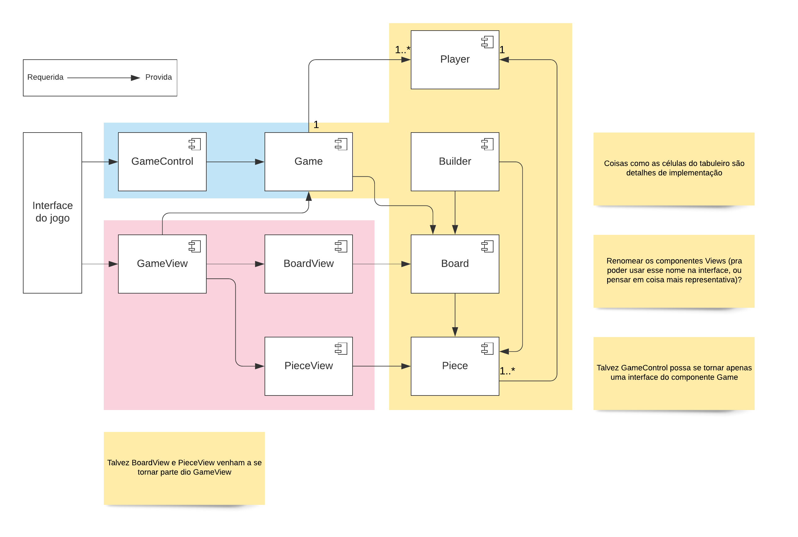
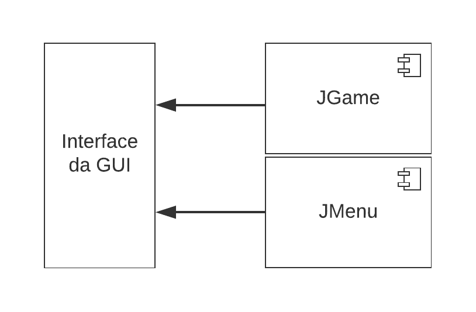

# Projeto _Taalt!_

## Descrição Resumida

_Taalt!_, como foi batizado pela nossa equipe, é um jogo inspirado em uma classe abstrata de jogos de tabuleiros, conhecida como _Jogo ❬m, n, k❭_. Trata-se de uma generalização matemática do famoso jogo da velha (ou Tic-Tac-Toe), de modo que os parâmetros da partida podem ser variados.

De forma resumida, um jogo ❬m, n, k❭ possui um tabuleiro celular com as dimensões m × n, cujas células podem ser preenchidas por uma única peça cada, que por sua vez tem cores ou símbolos diferentes para cada um dos jogadores envolvidos. A condição de vitória é que um dos jogadores coloque *k* peças suas em sequência, seja na horizontal, na vertical, ou na diagonal.

Além dessas características, Taalt! ainda possui alguns elementos que distinguem sua jogabilidade. Dentre tais elementos, incluem-se a possibilidade de jogar com ou sem gravidade (que faz as peças caírem para a parte de baixo do tabuleiro), o número de jogadores (dois a quatro), as direções válidas para alinhar peças (com ou sem diagonais, por exemplo) e o tipo de visualização do tabuleiro (pela linha de comando ou interface gráfica).

## Equipe
* Daniel Credico de Coimbra
* Daniel Paulo Garcia

## Vídeos do Projeto
* [Vídeo da Prévia](assets/Taalt_prévia.mp4)

## Slides do Projeto
* [Slides da Prévia](assets/Taalt_prévia.pdf)

## Documentação dos Componentes

### Diagramas

#### Diagrama Geral do Projeto
Descrição breve. Estilo arquitetural Model-View-Controller.

#### Diagrama dos Componentes do Jogo
Descrição breve.

#### Diagrama dos Componentes da GUI
Descrição breve também, como todas as outras.

## Componentes

### Componente `Exemplo1`
Resumo de papeis e serviços.

**Ficha Técnica**
item | detalhamento
----- | -----
Classe | `lab07.src.bin.Exemplo1`
Autores | `Grupo Daniel x Daniel`
Interfaces | `IExemplo1, IExemplo2, IExemplo3`

**Interfaces associadas**

Interface agregadora do componente em Java:
~~~java
public interface IExemplo3 extends IExemplo1, IExemplo2 {
}
~~~

### Componente `Exemplo2`
Resumo de papeis e serviços.

**Ficha Técnica**
item | detalhamento
----- | -----
Classe | `lab07.src.bin.Exemplo2`
Autores | `Grupo Daniel x Daniel`
Interfaces | `IExemplo4, IExemplo5, IExemplo6`

**Interfaces associadas**

Interface agregadora do componente em Java:
~~~java
public interface IExemplo4 extends IExemplo5, IExemplo6 {
}
~~~

## Detalhamento das Interfaces
### Interface `IExemplo1`
Resumo do papel da interface.
~~~java
public interface IExemplo1 {
  int método1();
  boolean método2();
}
~~~
Método | Objetivo
-------| --------
`método1` | `Objetivos e parâmetros`
`método2` | `Objetivos e parâmetros`

### Interface `IExemplo2`
Resumo do papel da interface.
~~~java
public interface IExemplo1 {
  String[] método3();
  String[][] método4();
}
~~~
Método | Objetivo
-------| --------
`método3` | `Objetivos e parâmetros`
`método4` | `Objetivos e parâmetros`

## Plano de Exceções

### Diagrama da hierarquia de exceções

### Descrição das classes de exceção
Classe | Descrição
----- | -----
Exceção1 | Engloba tal coisa.
Exceção2 | Indica tal coisa.
Exceção3 | Cobre tal caso.
