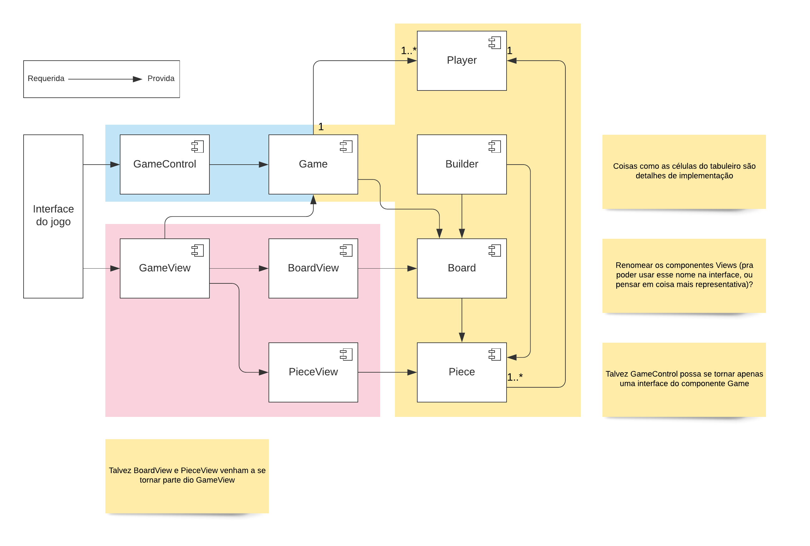
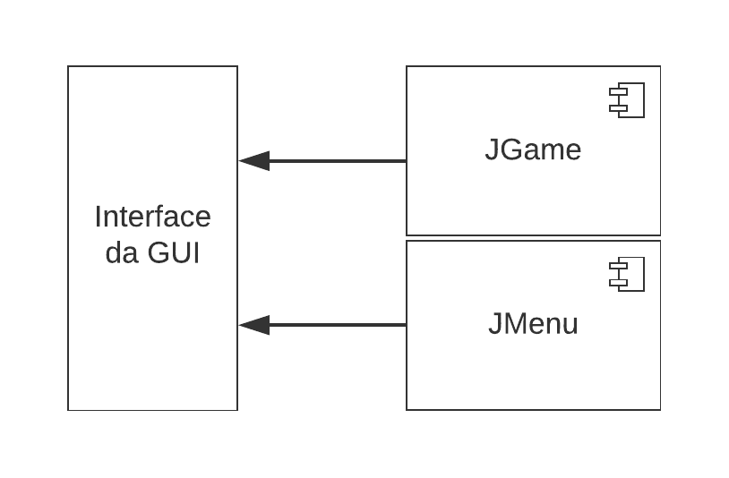

# Projeto _Taalt!_

## Descrição Resumida

_Taalt!_, como foi batizado pela nossa equipe, é um jogo inspirado em uma classe abstrata de jogos de tabuleiros, conhecida como _Jogo ❬m, n, k❭_. Trata-se de uma generalização matemática do famoso jogo da velha (ou Tic-Tac-Toe), de modo que os parâmetros da partida podem ser variados.

De forma resumida, um jogo ❬m, n, k❭ possui um tabuleiro celular com as dimensões m × n, cujas células podem ser preenchidas por uma única peça cada, que por sua vez tem cores ou símbolos diferentes para cada um dos jogadores envolvidos. A condição de vitória é que um dos jogadores coloque *k* peças suas em sequência, seja na horizontal, na vertical, ou na diagonal.

Além dessas características, Taalt! ainda possui alguns elementos que distinguem sua jogabilidade. Dentre tais elementos, incluem-se a possibilidade de jogar com ou sem gravidade (que faz as peças caírem para a parte de baixo do tabuleiro), o número de jogadores (dois a quatro), as direções válidas para alinhar peças (com ou sem diagonais, por exemplo) e o tipo de visualização do tabuleiro (pela linha de comando ou interface gráfica).

## Equipe
* Daniel Credico de Coimbra
* Daniel Paulo Garcia

## Vídeos do Projeto
* [Vídeo da Prévia](assets/Prévia_Vídeo.mp4)

## Slides do Projeto
* [Slides da Prévia](assets/Prévia_Slides.pdf)

## Documentação dos Componentes

### Diagramas

#### Diagrama Geral do Projeto
Tentamos empregar o estilo arquitetural Model-View-Controller. Existem elementos controladores e visuais dentro do componente GameClient (responsável pela visualização do jogo e por enviar comandos do usuário), enquanto que o componente GameServer é responsável pelo modelo. Este segundo componente é projetado para funcionar de maneira completamente independente de um componente gráfico, sendo portanto acoplável a qualquer outro modo de visualização.

#### Diagrama dos Componentes de GameServer
Gerencia e atualiza o estado atual do jogo.

#### Diagrama dos Componentes de GameClient
Visualização da partida, interface de input, e controlador de janelas.

## Componentes

### Componente `GameServer`
Este componente possui uma classe principal GameServer que administra as operações recebidas do usuário. Um componente externo tanto pode enviar comandos pela interface IGameAction, quanto também requerer informações do jogo via IGameView. O componente GameServer admite observadores (listeners) que serão avisados automaticamente de quaisquer mudanças no estado interno do jogo, via interface requerida IUpdateView. Por fim, GameServer é criado com auxílio da classe GameBuilder através da interface IGameBuilder.

**Ficha Técnica**
item | detalhamento
----- | -----
Classe | `gameserver.GameServer`
Autores | `Grupo Daniel x Daniel`
Interfaces | `IGameBuilder, IGameAction, IGameView, IUpdateView`

**Interfaces associadas**
Interface agregadora do componente em Java:
~~~java
public interface IGame extends IGameBuilder, IGameAction, IGameView, IUpdateView {
}
~~~

## Detalhamento das Interfaces (Game Controller)
### Interface `IGameBuilder`
Permite a inicialização de GameServer.
~~~java
public interface IGameBuilder {
  Board build(Options input);
}
~~~
Método | Objetivo
-------| --------
`build` | `Recebe um objeto Options com as especificações de uma partida. Chama GameBuilder e retorna o que ele retornar.`

### Interface `IGameAction`
Permite a entrada de um input.
~~~java
public interface IGameAction {
  void command(Input input);
}
~~~
Método | Objetivo
-------| --------
`command` | `Recebe um objeto Input especificando uma tentativa de jogada.`

### Interface `IGameView`
Resumo do papel da interface.
~~~java
public interface IGameView {
  Output getCell(int row, int col);
}
~~~
Método | Objetivo
-------| --------
`getCell` | `Recebe as coordenadas de uma célula e devolve informações sobre ela e sobre o estado atual do jogo, encapsuladas num objeto Output.`

### Interface `IUpdateView`
Resumo do papel da interface.
~~~java
public interface IUpdateView {
  void addUpdateListener(UpdateListener listener);
  void notify();
}
~~~
Método | Objetivo
-------| --------
`addUpdateListener` | `Adiciona um objeto UpdateListener à lista de observadores.`
`notify` | `Notifica os observadores que uma atualização interna ocorreu.`

### Componente `GameClient`
Este componente possui um controlador principal 
Manager que administra a criação e exibição das janelas MainMenu, onde o usuário insere opções e pode inicializar o jogo, e GameScreen, onde uma partida é exibida e na qual se pode interagir com o tabuleiro. WindowManager serve como ponto de entrada de nosso programa, e por meio de sua interface é possível criar um jogo via IGameBuilder. Inputs serão inseridos via IGameAction e atualizações sobre o tabuleiro serão sinalizadas via IUpdateView e obtidas via IGameView.

**Ficha Técnica**
item | detalhamento
----- | -----
Classe | `gameclient.Window`
Autores | `Grupo Daniel x Daniel`
Interfaces | `IExemplo4, IExemplo5, IExemplo6`

**Interfaces associadas**

Interface agregadora do componente em Java:
~~~java
public interface IExemplo4 extends IExemplo5, IExemplo6 {
}
~~~

## Detalhamento das Interfaces

### Interface `IExemplo2`
Resumo do papel da interface.
~~~java
public interface IExemplo1 {
  String[] método3();
  String[][] método4();
}
~~~
Método | Objetivo
-------| --------
`método3` | `Objetivos e parâmetros`
`método4` | `Objetivos e parâmetros`

## Plano de Exceções

### Diagrama da hierarquia de exceções

### Descrição das classes de exceção
Classe | Descrição
----- | -----
Exceção1 | Engloba tal coisa.
Exceção2 | Indica tal coisa.
Exceção3 | Cobre tal caso.
