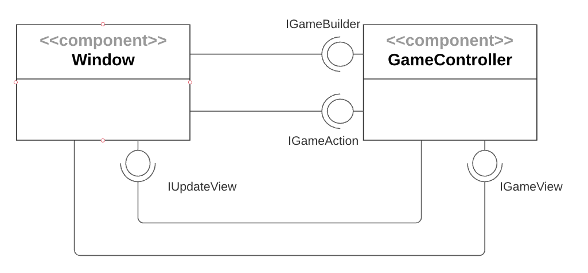
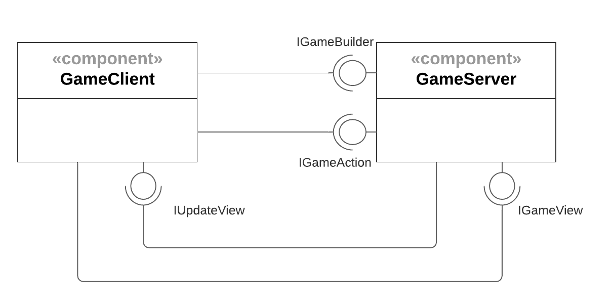
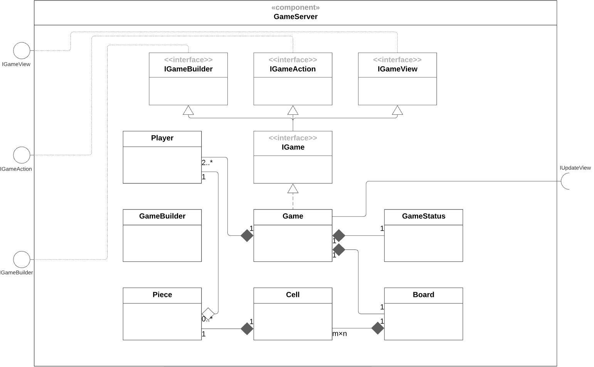
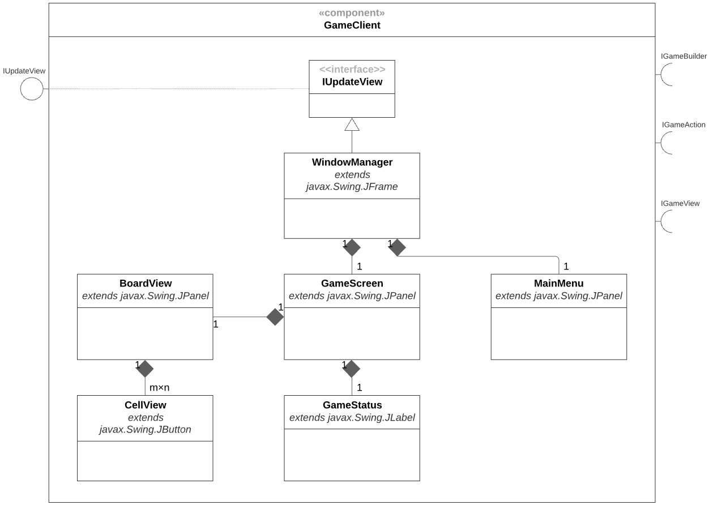
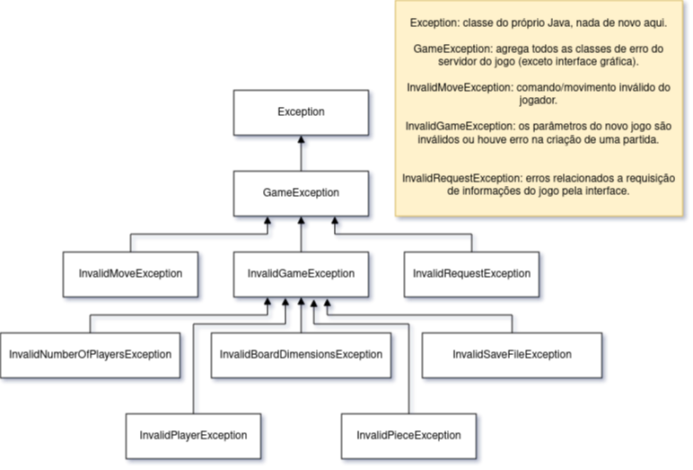

# Projeto _Taalt!_

## Descrição Resumida

_Taalt!_, como foi batizado pela nossa equipe, é um jogo inspirado em uma classe abstrata de jogos de tabuleiros, conhecida como _Jogo ❬m, n, k❭_. Trata-se de uma generalização matemática do famoso jogo da velha (ou Tic-Tac-Toe), de modo que os parâmetros da partida podem ser variados.

De forma resumida, um jogo ❬m, n, k❭ possui um tabuleiro celular com as dimensões m × n, cujas células podem ser preenchidas por uma única peça cada, que por sua vez tem cores ou símbolos diferentes para cada um dos jogadores envolvidos. A condição de vitória é que um dos jogadores coloque *k* peças suas em sequência, seja na horizontal, na vertical, ou na diagonal.

Além dessas características, Taalt! ainda possui alguns elementos que distinguem sua jogabilidade. Dentre tais elementos, incluem-se a possibilidade de jogar com ou sem gravidade (que faz as peças caírem para a parte de baixo do tabuleiro), o número de jogadores (dois a quatro), as direções válidas para alinhar peças (com ou sem diagonais, por exemplo) e o tipo de visualização do tabuleiro (pela linha de comando ou interface gráfica).

## Equipe
* Daniel Credico de Coimbra
* Daniel Paulo Garcia

## Vídeos do Projeto
* [Vídeo da Prévia](assets/Prévia_Vídeo.mp4)

## Slides do Projeto
* [Slides da Prévia](assets/Prévia_Slides.pdf)

## Documentação dos Componentes

### Diagramas

#### Diagrama Geral do Projeto
Tentamos empregar um misto dos estilos arquiteturais Cliente-Servidor (como mostra a figura) e do Model-View-Controller, ficando View e Controller a cargo da Interface do Usuário, enquanto que o Model é gerido pelo servidor do Jogo.

#### Diagrama Geral dos Componentes
O componente GameClient é responsável pela visualização do jogo e por enviar comandos do usuário. Já no componente GameServer há elementos do modelo do jogo. GameServer é projetado para funcionar de maneira completamente independente de um componente gráfico, sendo portanto acoplável a qualquer outro modo de visualização.

#### Diagrama dos Componentes de GameServer
Gerencia e atualiza o estado atual do jogo.

#### Diagrama dos Componentes de GameClient
Visualização da partida, interface de input, e controlador de janelas.

## Componentes

### Componente `GameServer`
Este componente possui uma classe principal Game que administra as operações recebidas do usuário. Um componente externo tanto pode enviar comandos pela interface IGameAction, quanto também requerer informações do jogo via IGameView. O componente admite observadores (observers/listeners) que serão avisados automaticamente de quaisquer mudanças no estado interno do jogo, via interface requerida IUpdateView. Por fim, Game é criado recebendo informações das opções da partida através da interface IGameBuilder.

**Ficha Técnica**
item | detalhamento
----- | -----
Classe | `gameserver.GameServer`
Autores | `Grupo Daniel x Daniel`
Interfaces | `IGameBuilder, IGameAction, IGameView`

**Interfaces associadas**
Interface agregadora do componente em Java:
~~~java
public interface IGame extends IGameBuilder, IGameAction, IGameView {
}
~~~

## Detalhamento das Interfaces (Game Controller)
### Interface `IGameBuilder`
Permite a inicialização de GameServer.
~~~java
public interface IGameBuilder {
  void build(Options input);
}
~~~
Método | Objetivo
-------| --------
`build` | `Recebe um objeto Options com as especificações da partida e constrói os objetos necessários.`

### Interface `IGameAction`
Permite a entrada de um input.
~~~java
public interface IGameAction {
  void command(Input input);
}
~~~
Método | Objetivo
-------| --------
`command` | `Recebe um objeto Input especificando uma tentativa de jogada.`

### Interface `IGameView`
Resumo do papel da interface.

~~~java
import gameserver.Output;

public interface IGameView {
    Output getCell(Point pos);
}
~~~
Método | Objetivo
-------| --------
`getCell` | `Recebe as coordenadas de uma célula e devolve informações sobre ela e sobre o estado atual do jogo, encapsuladas num objeto gameserver.Output.`

### Componente `GameClient`
Este componente possui uma classe WindowManager que administra a criação e exibição das janelas MainMenu, onde o usuário insere opções e pode inicializar o jogo, e GameScreen, onde uma partida é exibida e na qual se pode interagir com o tabuleiro. WindowManager serve como ponto de entrada de nosso programa, e por meio da interface requerida IGameBuilder é possível criar um jogo. Inputs serão inseridos via IGameAction e atualizações sobre o tabuleiro serão sinalizadas via IUpdateView e obtidas via IGameView.

**Ficha Técnica**
item | detalhamento
----- | -----
Classe | `gameclient.GameClient`
Autores | `Grupo Daniel x Daniel`
Interfaces | `IUpdateView`

## Detalhamento das Interfaces

### Interface `IUpdateView`
Resumo do papel da interface.
~~~java
public interface IUpdateView {
  void notify();
}
~~~
Método | Objetivo
-------| --------
`notify` | `Notifica os observadores (tabuleiro e suas células) que uma atualização interna ocorreu.`

## Plano de Exceções

### Diagrama da hierarquia de exceções

### Descrição das classes de exceção
Classe | Descrição
----- | -----
GameException | Abarca todas as exceções relacionadas ao servidor do jogo (exceto interface gráfica).
InvalidMoveException | Indica tentativa inválida de jogada por parte do jogador.
InvalidRequestException | Indica requisição inválida de informações do jogo por parte da interface gráfica.
InvalidGameException | Engloba todas as exceções relacionadas à configuração da partida.
InvalidNumberOfPlayersException | Indica quantia selecionada inválida de jogadores.
InvalidBoardDimensionException | Indica dimensão selecionada inválida de tabuleiro.
InvalidSaveFileException | Indica que o _save file_ está corrompido.
InvalidPlayerException | Indica que o jogador não está configurado adequadamente.
InvalidPieceException | Indica que a peça não está configurada adequadamente.
